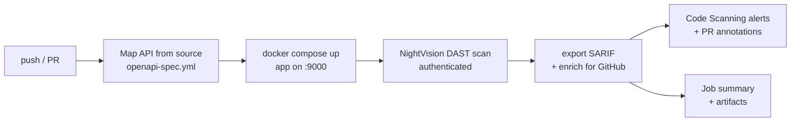

# NightVision DAST in GitHub Actions (Java / Spring)

A deliberately vulnerable Spring Boot app ([JavaSpringVulny](src/main/java/hawk)) wired to
NightVision in GitHub Actions. Every push and pull request builds the app, maps its API from
source, runs a NightVision DAST scan against the running container, and reports what it proved
straight into GitHub Code Scanning, pointing at the controller that handles each vulnerable route.



## What you see after a run

- **Security → Code scanning**: one alert per finding, ranked by real severity (SQL injection and
  Spring4Shell are Critical, not lumped in with missing headers), tagged with CWE, and pinned to
  the handler line, for example `SearchController.java:36` for `POST /search`.
  Each alert links to the request and response in NightVision that prove it.
- **Pull requests**: new findings show up as annotations on the diff and in the Code scanning check.
- **Run summary**: a severity table with links to the code and to the proof for each finding.
- **Artifacts**: the raw NightVision SARIF, the enriched SARIF, the scan output, and the API spec.

## Setup

1. Create the NightVision target and login once (from a machine with the
   [NightVision CLI](https://docs.nightviz.ai)):

   ```sh
   nightvision target create javaspringvulny-api http://127.0.0.1:9000 --type api
   nightvision auth playwright create javaspringvulny-api http://127.0.0.1:9000
   ```

2. Add a NightVision API token as the repository secret `NIGHTVISION_TOKEN`.
3. Push to `main`, open a PR, or run **Actions → NightVision DAST → Run workflow**. Manual runs
   take a scan time budget; the default is 30 minutes, and longer budgets crawl deeper.

## How the reporting works

`nightvision export sarif` writes standard SARIF. [`scripts/nightvision-sarif-enrich.py`](scripts/nightvision-sarif-enrich.py)
then tunes it for how GitHub renders alerts: plain-text messages, rule help with remediation,
CWE tags, `error` level for critical and high findings, and a real file for app-wide findings.
Informational results stay in the raw SARIF artifact and in NightVision but are left out of
Code Scanning. Findings marked false positive or won't fix in NightVision are excluded too, so
triage happens once.

The script is standard-library Python and works with any NightVision SARIF export; try it locally:

```sh
python3 scripts/nightvision-sarif-enrich.py results.sarif -o github.sarif --summary summary.md
```

## Other workflows

| Workflow | Trigger | Adds |
|---|---|---|
| [`nightvision.yml`](.github/workflows/nightvision.yml) | push, PR, manual | the main demo |
| [`nightvision-slack.yml`](.github/workflows/nightvision-slack.yml) | manual | posts findings to Slack |
| [`nightvision-teams.yml`](.github/workflows/nightvision-teams.yml) | manual | posts findings to Microsoft Teams |
| [`nightvision-email.yml`](.github/workflows/nightvision-email.yml) | manual | emails findings |

All four report into the same Code Scanning category, so there is one set of alerts for the app.
The repo also carries equivalent pipelines for GitLab, Azure DevOps, Bitbucket, and Jenkins.

## Run it locally

```sh
docker compose up -d --build   # app on http://localhost:9000
```

This app is intentionally vulnerable. Do not expose it to the internet.
